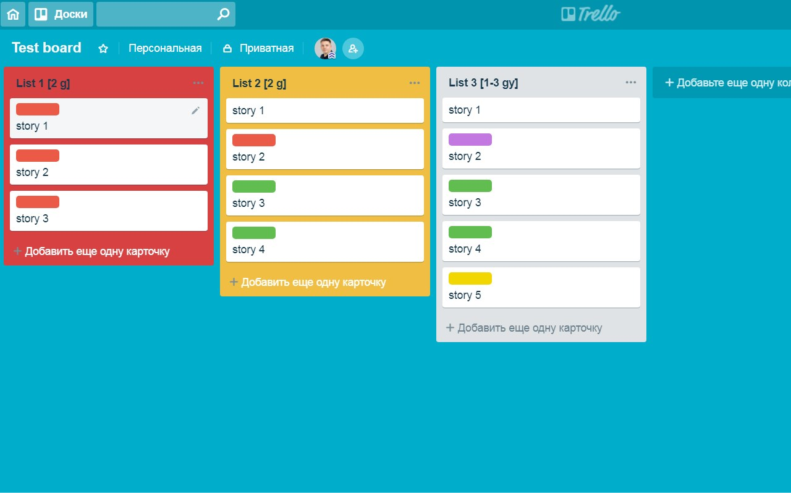

### 📊 Planificación de Proyectos de Bases de Datos con Trello

---

#### 📋 1. ¿Qué es Trello?

- **Trello** es una herramienta de gestión de proyectos que permite organizar tareas y proyectos en tableros visuales.
    - **Columnas**: Representan el flujo de trabajo, como `Por Hacer`, `En Proceso`, `Hecho`.
    - **Tarjetas**: Cada tarea es una tarjeta, que se puede mover entre columnas.
    - **Etiquetas**: Útiles para categorizar tareas según prioridad o tipo de actividad.

---

#### 🚀 2. Ventajas de Usar Trello para Bases de Datos

- **Organización Visual**: Facilita ver el estado de cada tarea en el proyecto.
- **Colaboración en Tiempo Real**: Todos los miembros del equipo pueden ver los cambios y actualizar tareas.
- **Gestión de Tareas**: Permite dividir el proyecto en tareas manejables, asignando responsabilidades claras.

---

#### 📂 3. Ejemplo de Tablero de Trello para un Proyecto de Bases de Datos

- **Columna 1 - Análisis**: Definir requerimientos y especificaciones del sistema de base de datos.
- **Columna 2 - Diseño**: Crear el modelo entidad-relación y definir tipos de datos.
- **Columna 3 - Implementación**: Escribir el código SQL y crear las tablas en el sistema de base de datos.
- **Columna 4 - Pruebas**: Realizar pruebas de inserción, actualización y eliminación de datos.
- **Columna 5 - Mantenimiento**: Monitorizar el rendimiento y realizar ajustes de optimización.

---

#### 💡 4. Consejos para Utilizar Trello en la Planificación de un Proyecto de Bases de Datos

- **Divide en Tareas Específicas**: Ej. "Definir tipos de datos para cada tabla" o "Crear índices en columnas de búsqueda".
- **Asigna Responsabilidades**: A cada miembro del equipo se le asignan tareas específicas.
- **Utiliza Checklists**: Dentro de cada tarjeta, añade checklists para subtareas, como "Definir campo clave", "Agregar restricciones", etc.
