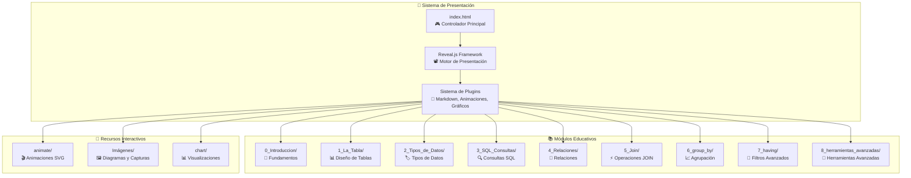
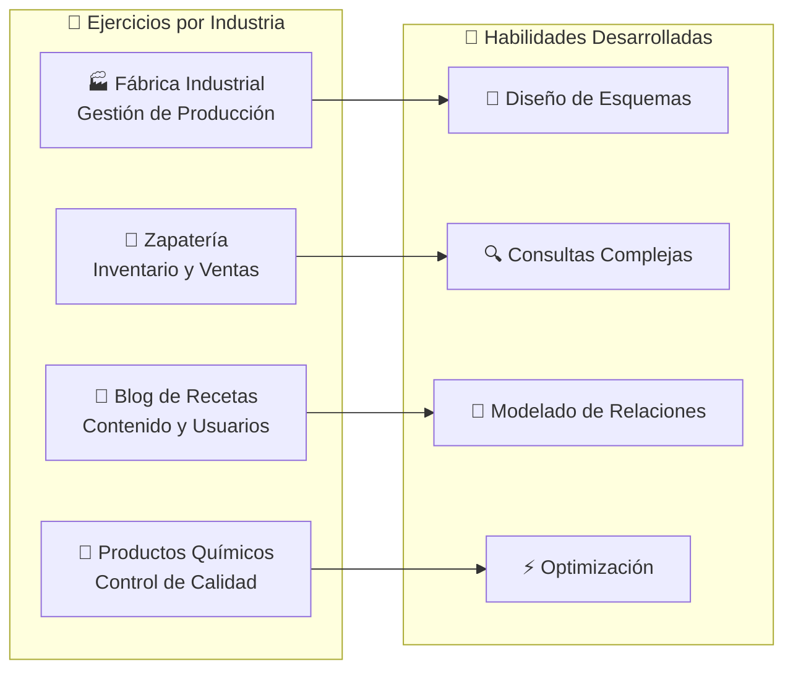
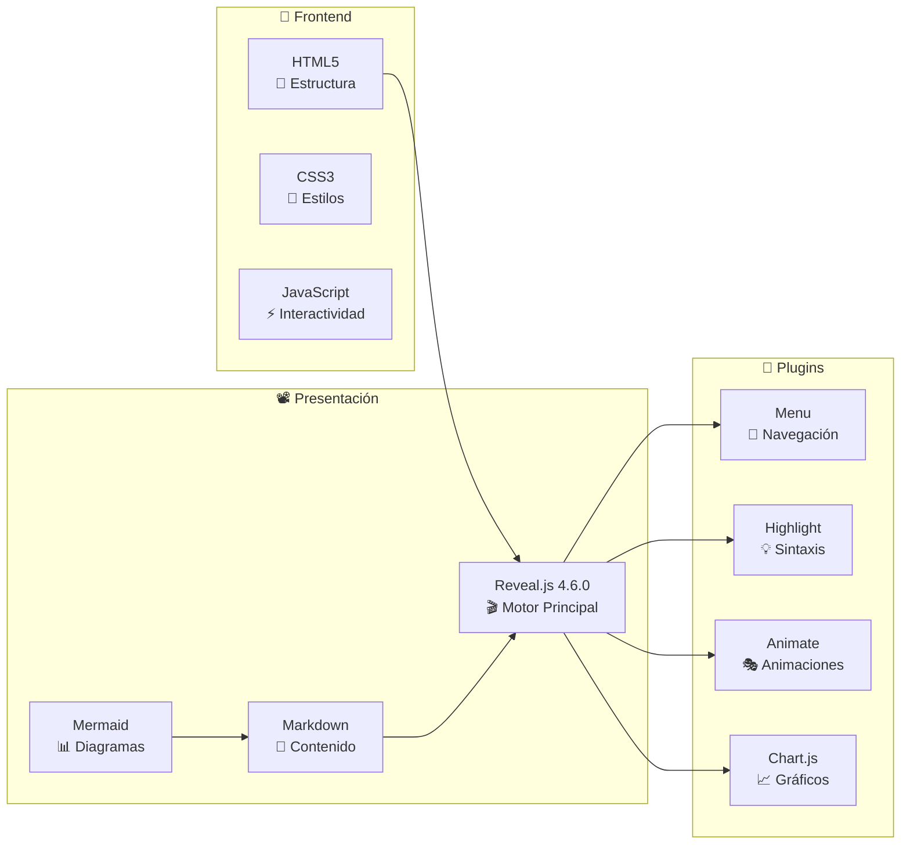
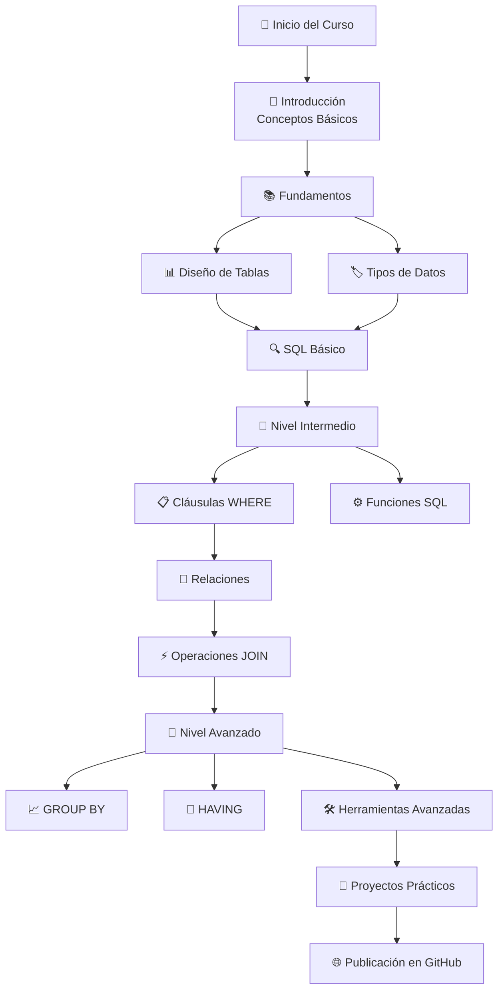

Aquí tienes el archivo README.md completo que te propuse anteriormente: <cite/>

```markdown
# 🐬 MySQL Nivel 0 - Sistema Educativo Interactivo

<div align="center">
  
  
  [](https://sanchezluys.github.io/MySQL-Nivel-0/)
  [](https://revealjs.com/)
  [](https://mysql.com/)
</div>

## 📋 Descripción

Sistema educativo interactivo para el aprendizaje de MySQL desde nivel básico hasta herramientas avanzadas. [1](#1-0)  Utiliza presentaciones web dinámicas con **Reveal.js** para ofrecer una experiencia de aprendizaje moderna e interactiva. [2](#1-1) 

## 🎯 Objetivos del Curso

- 🗄️ **Bases de datos Relacionales**: Comprender la estructura de datos en tablas relacionadas
- 📊 **Tablas**: Crear y gestionar tablas de forma eficiente  
- 🔗 **Relaciones entre tablas**: Establecer relaciones mediante claves primarias y foráneas
- 🛠️ **CRUD**: Realizar operaciones básicas (Crear, Leer, Actualizar, Eliminar)
- 🔍 **Consultas SQL**: Ejecutar consultas para recuperar y manipular datos
- 🚀 **Publicar en GitHub**: Desarrollar y publicar una base de datos en GitHub

## 🏗️ Arquitectura del Sistema



## 📖 Contenido del Curso

### 🎓 Módulos Principales

| Módulo | Directorio | Descripción | 🎯 Nivel |
|--------|------------|-------------|----------|
| **Introducción** | `0_Introduccion/` | Fundamentos y objetivos del curso | Básico |
| **La Tabla** | `1_La_Tabla/` | Estructura y diseño de tablas | Básico |
| **Tipos de Datos** | `2_Tipos_de_Datos/` | Especificaciones de tipos MySQL | Básico |
| **SQL Consultas** | `3_SQL_Consultas/` | Operaciones básicas e intermedias | Intermedio |
| **Relaciones** | `4_Relaciones/` | Modelado entidad-relación | Intermedio |
| **JOIN** | `5_Join/` | Técnicas de unión de tablas | Intermedio |
| **GROUP BY** | `6_group_by/` | Agregación de datos | Avanzado |
| **HAVING** | `7_having/` | Filtrado condicional | Avanzado |
| **Herramientas Avanzadas** | `8_herramientas_avanzadas/` | Vistas, procedimientos, triggers | Avanzado |

### 🛠️ Ejercicios Prácticos



## 🚀 Inicio Rápido

### 📋 Requisitos

- 💻 **Computadora** con navegador web moderno
- 🌐 **Conexión a Internet** para CDN de librerías
- ☁️ **Servidor MySQL** (local o en la nube)
- 💻 **MySQL Workbench** (recomendado)
- 🌐 **Cuenta GitHub** para proyectos

### 🎮 Uso Local

1. **Clona el repositorio**:
   ```bash
   git clone https://github.com/sanchezluys/MySQL-Nivel-0.git
   cd MySQL-Nivel-0
   ```

2. **Abre en navegador**:
   ```bash
   # Opción 1: Servidor local simple
   python -m http.server 8000
   
   # Opción 2: Abrir directamente
   open index.html
   ```

3. **Navega por los módulos**:
   - Usa el menú 📋 en la esquina inferior izquierda
   - Navega con las flechas del teclado
   - Presiona `Esc` para vista general

### 🌐 Acceso Online

Visita: [https://sanchezluys.github.io/MySQL-Nivel-0/](https://sanchezluys.github.io/MySQL-Nivel-0/)

## 🛠️ Tecnologías Utilizadas



## 📁 Estructura del Proyecto

```
MySQL-Nivel-0/
├── 📄 index.html                    # Controlador principal
├── 📁 0_Introduccion/              # Módulo de introducción
│   ├── introduccion.md
│   └── *.png                       # Imágenes de apoyo
├── 📁 1_La_Tabla/                  # Diseño de tablas
├── 📁 2_Tipos_de_Datos/            # Tipos de datos MySQL
├── 📁 3_SQL_Consultas/             # Consultas SQL
├── 📁 4_Relaciones/                # Relaciones entre tablas
├── 📁 5_Join/                      # Operaciones JOIN
├── 📁 6_group_by/                  # Agrupación de datos
├── 📁 7_having/                    # Filtros con HAVING
├── 📁 8_herramientas_avanzadas/    # Vistas, procedimientos, triggers
├── 📁 100_Talleres/                # Talleres prácticos
├── 📁 101_Tablas_Ejercicios/       # Ejercicios de tablas
├── 📁 400_GITHUB/                  # Integración con GitHub
├── 📁 500_TRELLO/                  # Gestión de proyectos
├── 📁 animate/                     # Animaciones SVG
├── 📁 chart/                       # Datos para gráficos
└── 📁 img/                         # Recursos gráficos
```

## 🎯 Flujo de Aprendizaje



## 🤝 Contribuir

¡Las contribuciones son bienvenidas! [3](#1-2) 

### 📝 Cómo Contribuir

1. **Fork** el repositorio
2. **Crea** una rama para tu feature (`git checkout -b feature/nueva-funcionalidad`)
3. **Commit** tus cambios (`git commit -am 'Añadir nueva funcionalidad'`)
4. **Push** a la rama (`git push origin feature/nueva-funcionalidad`)
5. **Abre** un Pull Request

### 🐛 Reportar Issues

- Usa las [GitHub Issues](https://github.com/sanchezluys/MySQL-Nivel-0/issues)
- Describe el problema claramente
- Incluye capturas de pantalla si es necesario

## 📄 Licencia

Este proyecto está bajo la Licencia MIT. Ver el archivo `LICENSE` para más detalles.

## 👨‍💻 Autor

**Luis Sánchez** - [@sanchezluys](https://github.com/sanchezluys)

## 🙏 Agradecimientos

- **Reveal.js** por el framework de presentaciones
- **MySQL** por la base de datos
- **GitHub Pages** por el hosting
- **Mermaid** por los diagramas
- La comunidad de desarrolladores por el feedback

---

<div align="center">
  
### 🌟 ¡Dale una estrella si te gusta el proyecto! ⭐

**[🚀 Ver Presentación](https://sanchezluys.github.io/MySQL-Nivel-0/) | [📚 Documentación](https://github.com/sanchezluys/MySQL-Nivel-0/wiki) | [🐛 Issues](https://github.com/sanchezluys/MySQL-Nivel-0/issues)**

</div>
```
[](https://deepwiki.com/sanchezluys/MySQL-Nivel-0)
Wiki pages you might want to explore:
- [Overview (sanchezluys/MySQL-Nivel-0)](/wiki/sanchezluys/MySQL-Nivel-0#1)
- [Development Workflow (sanchezluys/MySQL-Nivel-0)](/wiki/sanchezluys/MySQL-Nivel-0#4)
