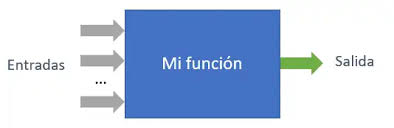

## 🌐 MySQL: Vistas, Eventos, Funciones, Procedimientos y Triggers

---

## 📊 Vistas

Las **vistas** son tablas virtuales que permiten visualizar datos sin duplicarlos. A continuación, se muestra el flujo de una vista:

---

## ⏳ Eventos

Los **eventos** son acciones programadas en MySQL que ocurren automáticamente en intervalos definidos o en un momento específico. Este es el flujo de un evento:

---

## 🛠️ Funciones

Las **funciones** permiten realizar cálculos y transformaciones en los datos de manera modular. El flujo típico de una función es el siguiente:

---

## 🌀 Procedimientos

Los **procedimientos almacenados** permiten ejecutar un conjunto de instrucciones en MySQL. Este es el flujo de un procedimiento:

---

## 🔁 Triggers

Los **triggers** son acciones automáticas que se ejecutan cuando ocurre un evento en una tabla (como una inserción o actualización). El flujo de un trigger es el siguiente:

---

## 🔗 Conclusión

En resumen, estos componentes permiten a MySQL gestionar datos de manera automatizada, modular y eficiente. Utiliza estos gráficos para entender cómo interactúan y mejorar el rendimiento de tus bases de datos. 🚀